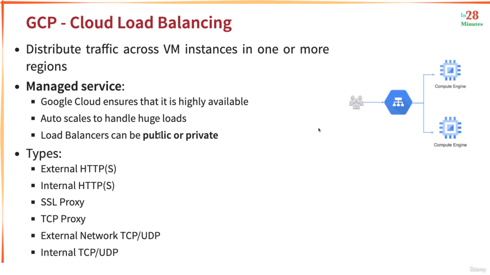
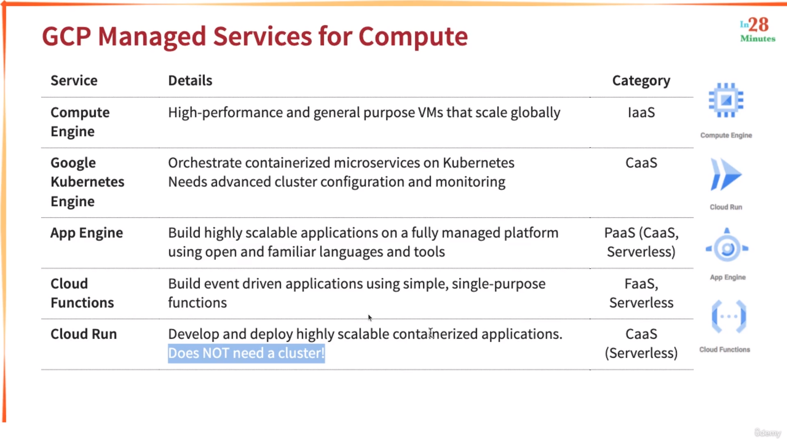
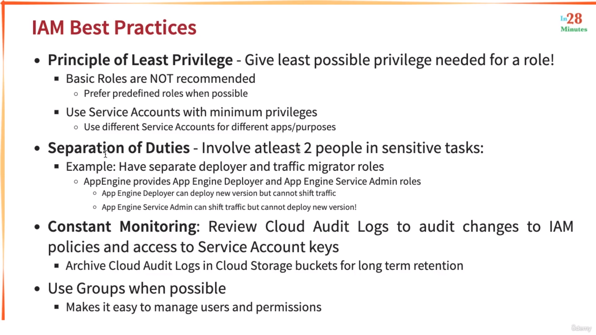
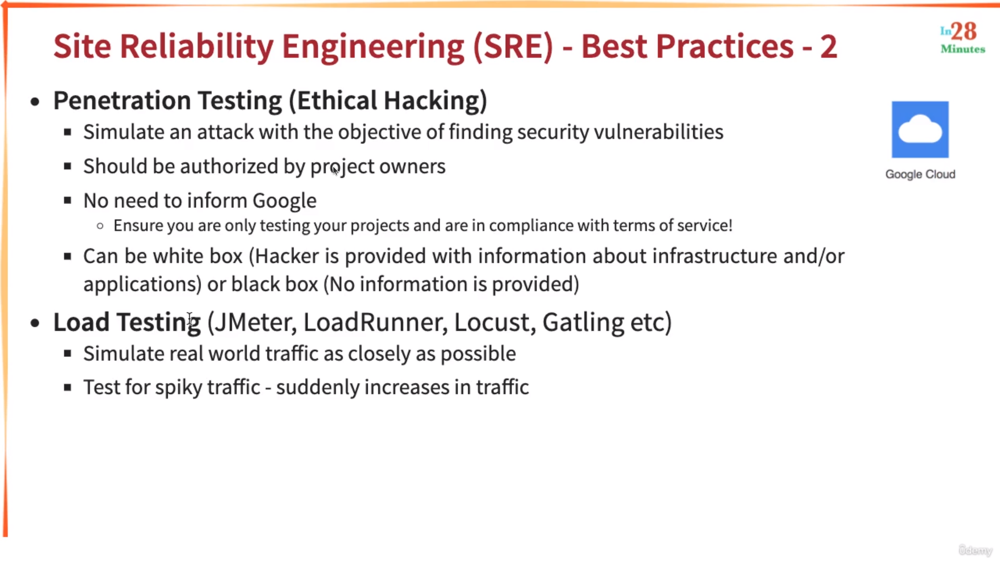
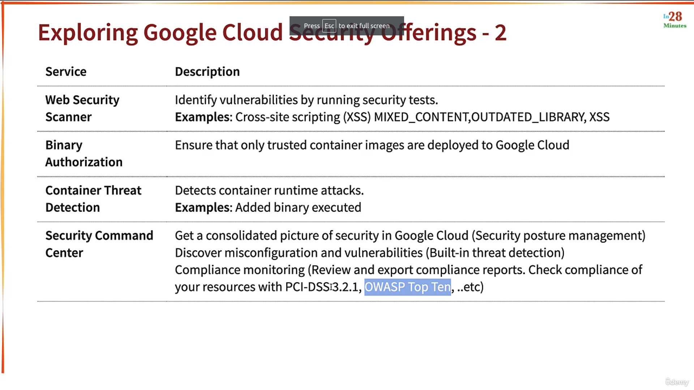
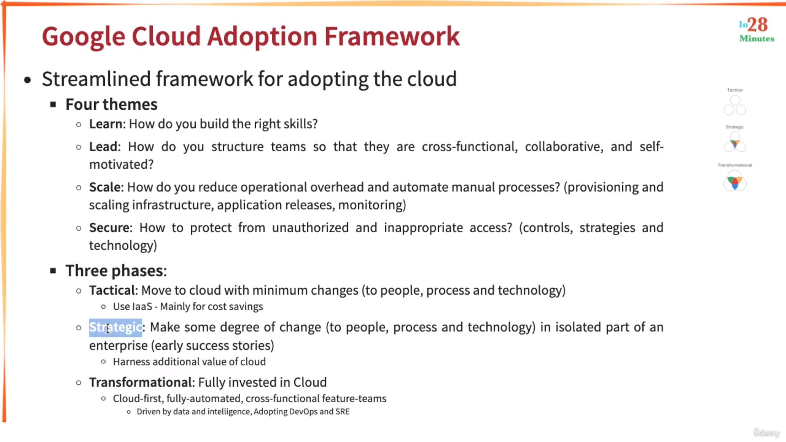
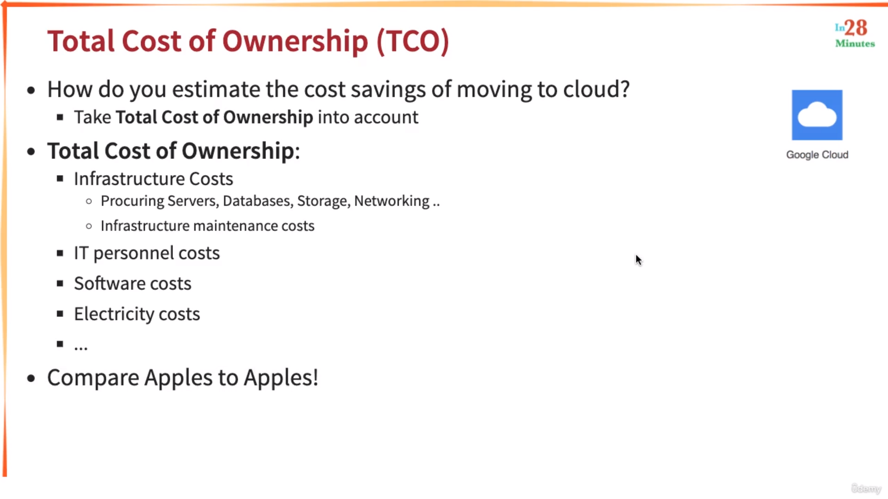
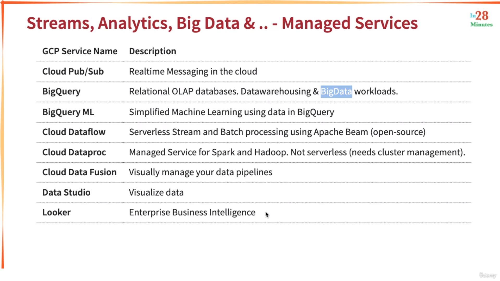

# GOOGLE CLOUD DIGITAL LEADER NOTES
Personalized Notes for the Google Cloud Digital Leader Certification. 

## Table Of Contents
01. [Introduction](#introduction)
02. [Google Compute Engine](#gce-google-compute-engine)
03. [Iaas, Paas, Saas](#iaas-paas-saas)
04. [GCP Compute Services](#gcp-compute-services)
05. [Databases](#databases)
06. [Identity Access Management](#iam)
07. [Resource Organization](#resource-organization-in-gcp)
08. [More on Virtual Machines](#vms-contd)
09. [DevOps](#devops)
10. [Decoupling with pub-sub](#decoupling-w-pub-sub)
11. [Other Services](#other-services)
12. [Architectures in the Cloud](#arcitectures-in-the-cloud)
13. [Cost Management in GCP](#cost-management-in-gcp)
14. [Summary](#final-review)
15. [Practice Test Notes](#notes)

## References
> https://www.udemy.com/course/google-cloud-digital-leader-certification/  
> https://github.com/in28minutes/course-material/blob/main/15-google-cloud-digital-leader/downloads.md   
> https://www.udemy.com/course/google-cloud-certified-cloud-digital-leader-practice-tests/

# Introduction

### Cloud Advantages
* Trade CAPEX for Variable expense. Meaning they don't own infrastructure now, but they rent

## Regions and Zones
* Each Region has three or more zones
* Each Zone has one or more discrete clusters

# GCE (Google Compute Engine)
### Image
* **Hardening an Image** means to create an image out of a GCE instance that adheres to the corporate standards of the organization
* You need to stop an instance before creating an image out of it. However there is still an option to take an image while the instance is running but it is not recommended

### Instance Template
* You cannot edit an instance template once you created it. You can only create a copy of it and modify the copy

## Discounts
### Sustained Discounts

* They are automatically applied for GCE and GKE

### Committed use discounts


## VMs
### Preemptible VM (Spot Instances)
* No SLA provided
* Not Always Available
* Free Tier Credits not applicable
* Highest Discount
* Can run only for a **maximum** duration of 24hrs

### Spot VMs
* Same as preemptible VMs but does not have a **maximum** runtime

### Sole Tenant Nodes

____
* By default, you'll have to pay for the OS that you are using on top of the GCE's price. 
* You can also use your license for the OS on the created VMs if you have one, or use the Pay-as-you-go model that charges you for OS as well on a hourly basis
> Note: There are some free OSes as well

### Custom Machine Types

* Billed per vCPUs and Memory 

## Instance Groups

* Regional means within a region
* Zonal means within a zone

### Managed Instance Groups (MiG)
* Managed Instance Groups is further divided into:
    * Stateless
    * Stateful (For persistent workloads like DB)
* MiGs are created using an instance template


## Load Balancer

* GCP Load Balancer is a global service

# IaaS, PaaS, SaaS
## PaaS
* Container as a Service (CaaS) - Containers instead of apps
* Function as a Service (FaaS) - Functions instead of apps
* Databases

## What are Microservices?
Services that have a specific goal of doing something. And multiple microservices make up an entire application. For example, An E-Commerce web application may consist of following microservices:
* A backend MS
* A frontend MS
* A webserver MS to handle HTTP reqs
* A database MS 
and so on... 

## Serverless
* Pay for use
* You pay for requests, not servers
* Ex: AWS Lambda, Google Functions

## SaaS
* Subscription-based applications (like Netflix)

## GCP Services


# GCP Compute Services

## App Engine


>  Note: Before using any service you haven't used before, you actually first enable the API of the app
## GKE


* GKE Commands start with: `gcloud container <command>`

### GKE commands
* `gcloud container cluster get-credentials my-cluster` to connect to K8s cluster
* `kubectl create deployment <deployment_name>` to create deployment  
* `kubectl expose deployment <deployment_name> --type=LoadBalancer --port=8080` 
* `kubectl scale deployment <deployment_name> --replicas=2` to scale the pods in K8s deployment 
* `gcloud container clusters resize my-cluster --node-pool default-pool --num-nodes=2` for scaling nodes in GKE cluster
* `kubectl autoscale deployment <deplyment_name> --max=10 --cpu-percent=70` auto scales pods based on CPU percentage
* `kubectl get hpa` | HPA (Horizontal Pod AutoScaling) 
* `gcloud container clusters update <cluster_name> --enable-autoscaling --min-nodes=1 --max-nodes=10`
* `kubectl delete deployment`
* `gcloud container clusters delete` deletes the GKE cluster

## Cloud Functions (~= AWS Lambda)

* MAX duration has been updated to 60 minutes (in v2)

## Cloud Run


# Storage in GCP

## Block Storage
* Can connect multiple block devices to one single server but not vice-versa


## File Storage 

* Cloud Filestore allows to share files in the cloud

### Types

* Local SSDs = High Performance
    * Local SSDs are attached to the VM and have very high throughput.  However, when the VM shuts down, the Local SSD is also shut down.  Since our workload here is fault tolerant, that is not an issue.
* Persistent Storage = High Globality

## Cloud Storage - An object Storage
* Name of the bucket must be globally unique 


## Storage Classes

* You can modify the storage class at the object level as well

## Object Lifecycle management
 

## Data Transfer to Cloud


* Google Recommends to use Transfer Appliance when transferring over 60 TB of data

# Databases
## Relational Databases
### OLTP
* Strong Transactional Capabilities


* `gcloud sql connect` is used to connect to Cloud SQL database
### OLAP

* **BigQuery** is GCP managed service for OLAP that handles petabytes of data
* Apart from BigQuery storing structured data (in rows N columns), it can also store data in unstructured format
* With the **on-demand pricing model** in BigQuery, you are charged for the number of bytes processed by each query. 
* BigQuery Monthly and Annual **reservations** can be used to provide guaranteed capacity for workloads with SLAs. This is also known as Flat Rate Pricing
* BigQuery **Flex slots** are a good way to test how your workloads perform with flat-rate billing, before purchasing a longer-term commitment. They are also useful for handling cyclical or seasonal demand, or for high-load events such as tax season.
    * BigQuery Flex Slots is best suited for for workloads that need to process a lot of data in a short time, and so would be less expensive to run using reserved slots for a short time.
* The first 1 TB of query data processed per month is free in BigQuery

## NoSQL Databases

* BigTable can scale globally

## In-Memory Databases (Cache)


## DB Scenarios


# IAM


> **AWS ROLES ARE COMPLETELY DIFFERENT FROM ROLES IN GCP**

## Roles


## Service Accounts
* Similar to EC2 instance Roles

* When creating a service account, you need to assign it to a user so that when he creates the VM, he can make use of the Service account
* Similarly, you can also have an admin privileges for Service account managing permissions and stuff

# Resource organization in GCP
##  Hierarchy structure


## Billing Accounts


## IAM Best Practices


## On-premises to GCP connection
### Cloud VPN

### Cloud Interconnect


### Direct Peering


## User Identity Management in GCP


## Organization's Policy Service
* Organization's Policy Service has more priority than IAM


## User Identity Platform
* For the end users of your Application


# VMs (..contd)
## Bare Metal


## VmWare Engine


## Migrate for Compute Engine
* For migrating (EC2)instances from other clouds


## Migrate for Anthos
* Anthos is used as a container orchestration tool when your cluster is running in multi-cloud and/or on-premises environments


# DevOps 
## CI/CD
### code analysis


### tools


### walkthrough


## IaC (Infrastructure as Code)

* Google Cloud Deployment Manager is a GCP service for IaC

## GCP Service for Operations


## Site Reliability Engineering (SRE)


### Key Metrics

* Error budget is like an internal thing where if the team fails to meet the SLA, there error budget goes down. If the team has exhausted their error budget then they have to slow down in production releases

### Best Practices




# Decoupling w/ Pub-Sub

* If the application has high load, it might send a lot of requests that the logging service might not be able to handle
* So, if we have a pub-sub (a message queue) in between, the logging service can pick up the requests only if it is ready


## Pub Sub
> ***Pub**lisher/**Sub**scriber*
* Auto scale to process billions of messages per day
* Low Cost (Pay for use)


* If multiple clients are attached to a same subscription, the messages are split between the clients
* If clients have seperate subscriptions all the messages are sent to every client

## DataFlow
* A GCP service to do some edubudi velai such as importing data from one service to another, compression of files, decompression of files and so on ..


# Other Services
## OverView
```
Dataproc - Manage Spark and Hadoop clusters (proc=processing)
Dataprep - Clean and prepare data (ETL)
Dataflow - Create data pipelines | (and can also perform ETL)
DataFusion - Visually manage data piplelines (Like Flowchart mayB)
DataStudio - Visualize data in BigQuery
Datalab - Provides Jypter Notebooks (IDE) with Data Science libraries
Looker - BI Tool
DataStream - Used to replicate and synchronize data

BigQuery - Ad Hoc complex analysis
BigTable - pre-defined time series data

ioT Core - Manage ioT devices
apiGee - Comprehensive API management
Cloud Endpoint - Basic API management; Complex to set up
API Gateway - Simpler newer API management

Speech-to-Text API 
Text-to-Speech API
Translation API - Translate texts into more than 100 languages
Natural Language API - Identify insights from unstructured texts
Cloud Vision API - Identifies objects from images and classifies them to PREDEFINED categories  
Auto ML - Build custom ML models with minimum expertise
Vertex AI - Make MLOps easier
BigQueryML - Create models by queying BigQuery (OLAP) DB 
*** Security Services in Security Section ***
```
* In Dataflow, you have to write code.  Either Java or Python, as of this writing.
> keep in mind Cloud Vision vs AutoML 


* Cloud Endpoints allows versioning of API

> You can run queries using BigQuery and DataProc on data that is present in Cloud Storage (S3)

## TPUs
* Tensor Processing Unit. Can be used (in GCE, GKE...) for ML workloads

## Firebase


## Container Registry


## Security

* Data Loss Prevention is aka DLP


## Support


### Zero Trust Security model
* In traditional IT security model, the security was implemented only at the network level. Users outside the network were supposed to be authenticated.
* But In ZTSM, every resource should have authentication at the resource-level as well. Even if an attacker gains access to the network, he needs to be authenticated for each resource as well.

> Multi-Region in GCP always means that multiple regions in the same Continent (Asia, US, Europe)

# Arcitectures in the cloud
## Cloud Native
* The goal of cloud native architectures is to increase software delivery velocity and increase service reliability


## Serverless Services in GCP


## Factors to consider while choosing a Region


# Google Cloud Adoption (Chumma Topic)
## GCP Adoption Framework


## Infrastructure Adoption


## Application Adoption


## Business Platform Modernization


# Cost Management in GCP
> ## Already Known info mentioned below
 


> ## New info mentioned below


## Cost Management Tools


## Best Practices


# Final Review




# Notes
* Cloud Logging is not a place to retain or analyze external logs.
* **Chronicle** is a cloud service designed for enterprises to privately retain, analyze, and search the massive amounts of security and network telemetry they generate. Chronicle normalizes, indexes, correlates, and analyzes the data to provide instant analysis and context on risky activity.
* By dividing a large table into smaller partitions, you can improve query performance, and you can control costs by reducing the number of bytes read by a query.
    * With the on-demand pricing model in BigQuery, you are charged for the number of bytes processed by each query
* Some products like **Cloud Run** (serverless) are managed within Google Cloud infrastructure, but outside of customer VPCs.
* AppSheet is a no-code application development tool. It integrates with Google Sheets.
* Google Recommends to use **Transfer Appliance** when transferring over 60TB of data
* Cloud SQL supports MySQL, PostgreSQL, **Microsoft SQL Server**
* In ML, feature is input; label is output. A feature is one column of the data in your input set
* Managed GCP Services mapped with Open Source Services
    ```
    DataFlow = Apache Beam (for data/batch processing)
    DataFusion = CDAP
    DataProc = Hadoop/Spark
    Cloud Composer = Apache Airflow
    ```
* **Compliance Report Manager** consists of third-party audits and certifications, documentation, and contract commitments help support your compliance
* Google's **Data Labeling Service** lets you work with human labelers to generate highly accurate labels for a collection of data that you can use in machine learning models.
* **Cloud Router** enables you to dynamically exchange routes between your VPC and on-premises networks by using BGP
* Using **WAAP** (Web Application and API Protection) is the right protection plan: Anti-DDoS, anti-bot, WAF, and API protection help you protect against new and existing threats while helping you keep your apps and APIs compliant and continuously available.
* **IAP** (Identity Aware Proxy) lets you establish a central authorization layer for applications accessed by HTTPS, so you can use an application-level access control model instead of relying on network-level firewalls.
* **Dataplex** - Unified Data management across data lakes, data warehouses, and data marts
* **Database Migration Service** Available now for MySQL and PostgreSQL, with Oracle
* **AlloyDB** is a fully managed PostgreSQL-compatible database service
* VM instances that only have internal IP addresses (no external IP addresses) can use **Private Google Access**. They can reach the external IP addresses of Google APIs and services.
* Google provides **unified billing** for the open source tools that it has partenered with like MongoDB, Confluent, DataStax ...
* Leading software vendors provide **virtual desktop solutions** (VDI) on Google Cloud: Citrix, Itopia,
* When you enable **committed use discount sharing**, all of your current active committed use discounts in all the projects come under the same Cloud Billing account
* Notebooks is a managed service that offers an integrated and secure JupyterLab environment for data scientists 
* Google Cloud Directory Sync integrates with most LDAP management systems and can synchronize identities like Active Directory
* In Google's CDN service, your sites gets a single global IP (anycast IP)
* Bare Metal machines give you the ability to install any software but Sole-tenant nodes are still virtualized
* Cloud Trace is used for analyzing latency
* Titan Security Keys provide the highest level of security more than MFA using Mobile app
* VPC Network Peering allows internal IP address connectivity **across two Virtual Private Cloud** (VPC) networks regardless of whether they belong to the same project or the same organization.
    * Shared VPC is only **within an organization** - it allows an organization to connect resources from multiple projects to a common Virtual Private Cloud (VPC) network, so that they can communicate with each other securely and efficiently using internal IPs from that network.
* Bring your own IP (BYOIP) lets you provision and use your own public IPv4 addresses for Google Cloud resources
* **Cloud Identity Platform** allows you to manage identity and credentials for your consumer facing applications. Wheread **Cloud Identity** is for the enterprise.  It provides an email id with the org domain name, but with no access to Google Workspace tools like Docs, Sheets, Slides, etc.
* BigQuery also supports streaming data and its possible to do real time analytics on it.
* You can associated a Google Billing Account with a GCP organization or GCP Projects. There is no concept of associating a billing account with a folder
* Data Studio is a free tool and integrates well with BigQuery. Both creating and viewing reports are free.
* Migrate for Compute Engine’s advanced replication migration technology copies instance data to Google Cloud in the background with no interruptions to the source workload that’s running.
* Operations Suite provides integrated monitoring, logging, and trace managed services for applications and systems running on Google Cloud and beyond.
* Lending DocAI is a pre-packaged AI solution that speeds "up the mortgage workflow processes to easily process loans and automate document data capture, while ensuring the accuracy and breadth of different documents (e.g., tax statements and asset documents)."
* Cloud Scheduler is a fully managed enterprise-grade cron job scheduler. I
* Data is encrypted by Google Cloud at rest and in transit on Google Cloud.  However, encryption at time of processing is optional.
    * **Confidential Compute** is the option that allows you to encrypt data in use—while it’s being processed.