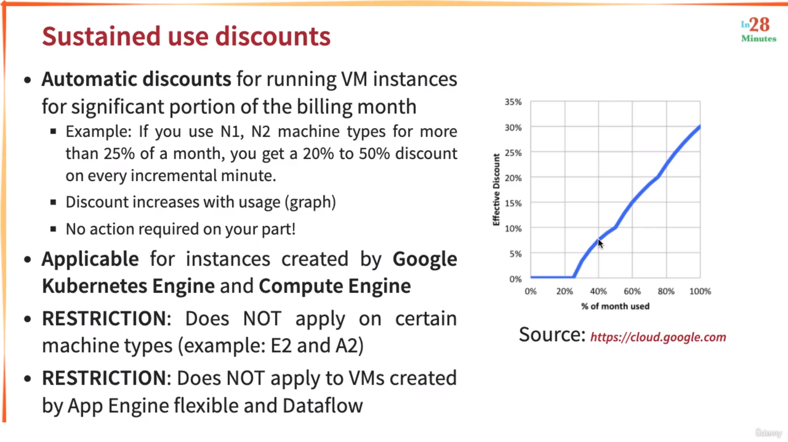
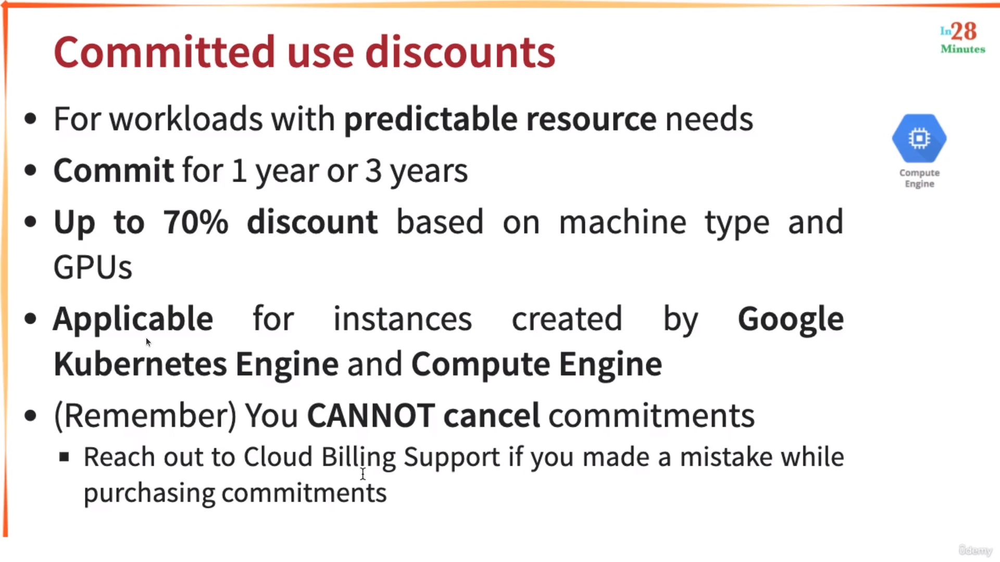
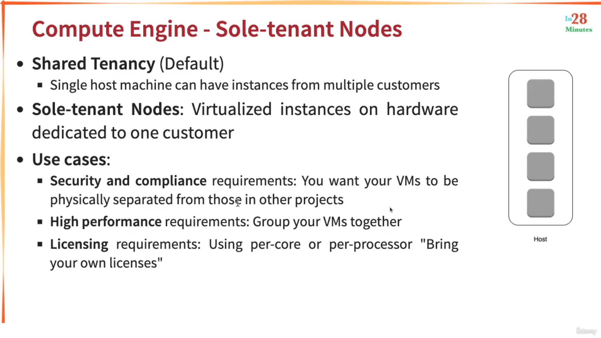
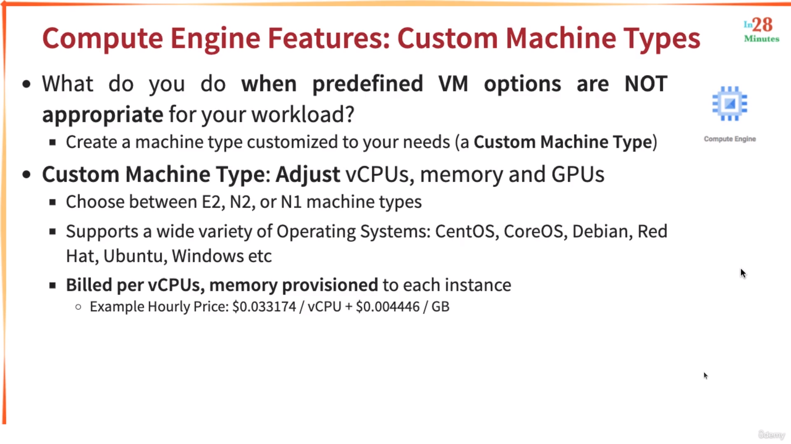
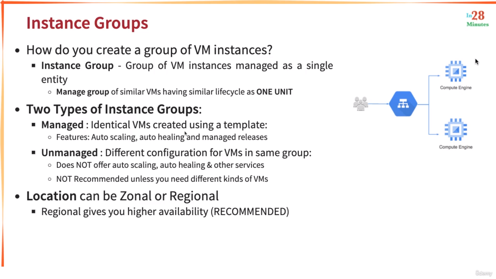
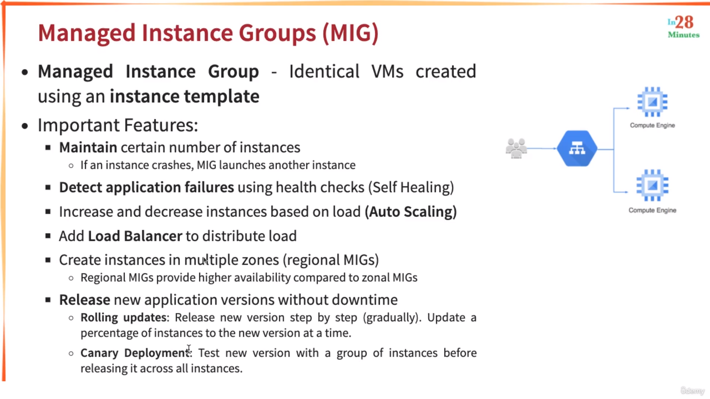
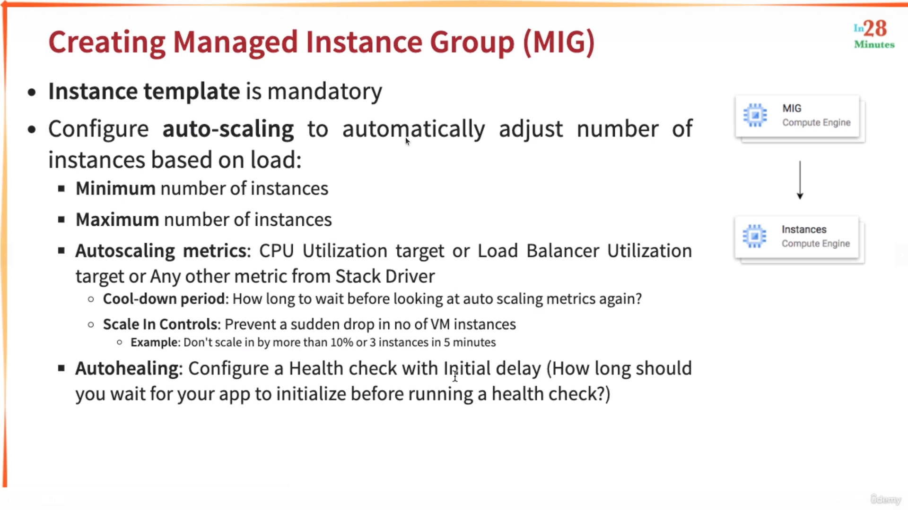
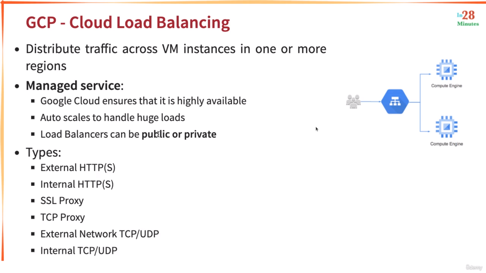
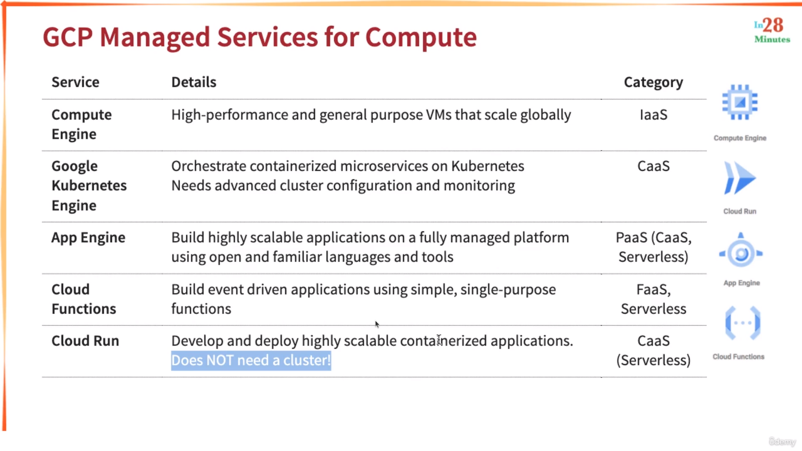

# Introduction

### Cloud Advantages
* Trade CAPEX for Variable expense. Meaning they don't own infrastructure now, but they rent

## Regions and Zones
* Each Region has three or more zones
* Each Zone has one or more discrete clusters

# GCE (Google Compute Engine)
### Image
* **Hardening an Image** means to create an image out of a GCE instance that adheres to the corporate standards of the organization
* You need to stop an instance before creating an image out of it. However there is still an option to take an image while the instance is running but it isnot recommended

### Instance Template
* You cannot edit an instance template once you created it. You can only create a copy of it and modify the copy

## Discounts
### Sustained Discounts

* They are automatically applied for GCE and GKE

### Committed use discounts

## VMs
### Preemptible VM (Spot Instances)
* No SLA provided
* Not Always Available
* Free Tier Credits not applicable
* Highest Discount
* Can run only for a **maximum** duration of 24hrs

### Spot VMs
* Same as preemptible VMs but does not have a **maximum** runtime

### Sole Tenant Nodes

____
* By default, you'll have to pay for the OS that you are using on top of the GCE's price. 
* You can also use your license to create VMs if you have one, or use the Pay-as-you-go model that charges you for OS as well on a hourly basis
> Note: There are some free OSes as well

### Custom Machine Types

* Billed per vCPUs and Memory 

## Instance Groups

* Regional means within a region
* Zonal means within a zone

### Managed Instance Groups (MiG)
* Managed Instance Groups is further divided into:
    * Stateless
    * Stateful (For persistent workloads like DB)
* MiGs are created using an instance template

## Load Balancer

* GCP Load Balancer is a global service

# IaaS, PaaS, SaaS
## PaaS
* Container as a Service (CaaS) - Containers instead of apps
* Function as a Service (FaaS) - Functions instead of apps
* Databases

## What are Microservices?
Services that have a specific goal of doing something. And multiple microservices make up an entire application. For example, An E-Commerce web application may consist of following microservices:
* A backend MS
* A frontend MS
* A webserver MS to handle HTTP reqs
* A database MS 
and so on... 

## Serverless
* Pay for use
* You pay for requests, not servers
* Ex: AWS Lambda, Google Functions

## SaaS
* Subscription-based applications (like Netflix)

## GCP Services
